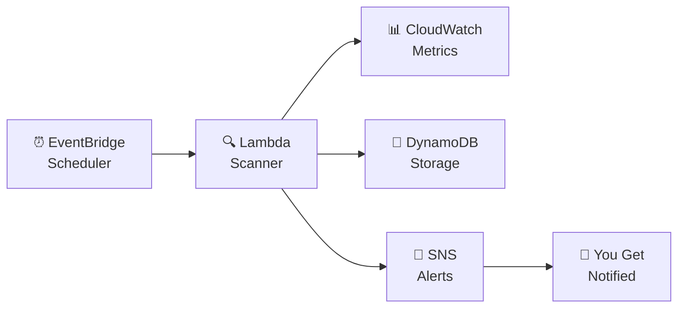

# ⚡ AWS Cost Optimizer
### *Because paying for cloud resources you're not using is just money down the drain.*

---

> **"You spin up an EC2 instance. You forget about it. You get a bill. You cry."**
> — Every developer who has ever used AWS.

This project exists to make sure that never happens to you again.

---

## 😩 The Problem (You've Been There)

Imagine this:

You're building something on AWS. You launch a few EC2 instances, test your stuff, and move on. A month later — **surprise!** Your AWS bill is way higher than expected. You dig in and realize those test servers were running 24/7... doing absolutely nothing.

Sound familiar? You're not alone.

This is one of the **biggest pain points** for anyone using AWS:
- Forgetting to shut down resources after testing
- Not knowing which services are sitting idle
- Getting zero warnings before a massive bill arrives
- Having no visibility into where your money is actually going

The average developer or team wastes **30–40% of their cloud budget** on resources they don't even use.

**That's the problem. This project is the solution.**

---

## ✅ What This Project Does

**AWS Cost Optimizer** is a fully serverless system that watches your AWS account 24/7, detects idle and underutilized resources, and alerts you in real time — so you can act before it costs you.

Think of it as your **personal AWS money-saving watchdog** 🐕 that never sleeps.

```
Your AWS Account
      │
      ▼
  🔍 Scanner runs every 6 hours
      │
      ▼
  📊 Checks CloudWatch metrics
      │
      ├── Idle resource found? ── YES ──▶ 💾 Save to DynamoDB
      │                                          │
      │                                          ▼
      │                                   📲 Send SMS Alert
      │
      └── No issues? ── ✅ All good, check again later
```

---

## 🏗️ Architecture



---

## ☁️ AWS Services Used & Why

| Service | Role | Why It's Used |
|---|---|---|
| **AWS Lambda** | Brain of the system | Runs code without a server — scales automatically |
| **Amazon CloudWatch** | Eyes of the system | Monitors CPU, network, and usage metrics |
| **Amazon DynamoDB** | Memory of the system | Stores all detected idle resource findings |
| **Amazon SNS** | Voice of the system | Sends you real-time SMS alerts |
| **Amazon EventBridge** | Heartbeat of the system | Triggers the scanner every 6 hours automatically |
| **AWS IAM** | Security guard | Controls what the system is allowed to touch |

---

## 🧠 How the Scanner Works (The Code)

The scanner has two key cost estimation functions inside `scanner.py`:

**`estimate_ec2_cost(instance_type)`**
Looks up how much each EC2 instance type costs per month. If the instance is sitting idle — it flags it immediately.

**`estimate_rds_cost(db_class)`**
Same logic for RDS databases. For example:
- `db.t3.micro` → ~$15/month
- `db.m5.large` → ~$130/month
- `db.r5.xlarge` → ~$350/month

If these are idle — you're paying for nothing. The scanner catches them.

> 👇 Here's the actual scanner code in VS Code:

.png>)

---

## 🛠️ Step-by-Step Setup

### Prerequisites
- An AWS account (free tier works!)
- Python 3.8+ installed
- AWS CLI installed

---

### 🔹 Step 1 — Configure AWS CLI

Open your terminal and run:
```bash
aws configure
```

Provide:
- **AWS Access Key ID** → from your AWS IAM user
- **AWS Secret Access Key** → from your AWS IAM user
- **Default Region** → `us-east-1`
- **Output format** → press Enter

---

### 🔹 Step 2 — Download the Project

```bash
git clone https://github.com/arkantandel/-AWS-Cost-Optimizer-Porject
cd -AWS-Cost-Optimizer-Porject
```

---

### 🔹 Step 3 — Install Dependencies

```bash
pip install boto3
```

---

### 🔹 Step 4 — Configure Your Settings

Open `deploy.py` and update the `CONFIG` section:

```python
CONFIG = {
    "region": "us-east-1",
    "phone_number": "+91XXXXXXXXXX",
    "project_name": "cost-optimizer",
    "cpu_threshold": 5,
    "idle_days": 7
}
```

---

### 🔹 Step 5 — Deploy Everything

```bash
python deploy.py
```

This one command automatically creates **everything** in your AWS account:
- ✅ Two Lambda functions (Scanner + Executor)
- ✅ DynamoDB table for storing findings
- ✅ SNS topic for SMS alerts
- ✅ EventBridge scheduler (runs every 6 hours)
- ✅ IAM roles with correct permissions

> 👇 After deploy, your Lambda console will show exactly 2 functions:

.png>)

Both functions use **Python 3.12** runtime and are deployed as **Zip** packages.

---

### 🔹 Step 6 — Set Lambda Environment Variables

Go to:
**AWS Console → Lambda → cost-optimizer-scanner → Configuration → Environment Variables → Edit**

> 👇 Fill in the values exactly like this:

.png>)

| Key | Value |
|---|---|
| `DYNAMODB_TABLE` | `cost-optimizer-findings` |
| `SNS_TOPIC_ARN` | `arn:aws:sns:us-east-1:YOUR-ACCOUNT-ID:cost-optimizer-alerts` |
| `SNS-THRESHOLD` | `5` |
| `IDLE_DAYS` | `7` |

Click **Save** when done.

> ⚠️ **Important:** If you see `DYNAMODB_TABLE` listed twice (like in the screenshot), remove the duplicate by clicking **Remove** on one of them.

---

### 🔹 Step 7 — Test the System Manually

Trigger the scanner right now from your VS Code terminal:

```bash
aws lambda invoke --function-name cost-optimizer-scanner --region us-east-1 --payload "{}" out.json
```

> 👇 This is what a successful test looks like:

.png>)

You'll get:
```json
{
  "StatusCode": 200,
  "FunctionError": "Unhandled",
  "ExecutedVersion": "$LATEST"
}
```

> 💡 `StatusCode: 200` = Lambda was reached and executed. `FunctionError: Unhandled` just means check the logs for details — see next step.

---

### 🔹 Step 8 — Check CloudWatch Logs

To see what happened inside the Lambda:

```bash
aws logs tail /aws/lambda/cost-optimizer-scanner --region us-east-1 --since 5m
```

> 👇 Here's what the logs look like:

.png>)

**Understanding the log output:**

| Log Message | What it means |
|---|---|
| `START RequestId` | Lambda started running ✅ |
| `END RequestId` | Lambda finished ✅ |
| `REPORT Duration: ~100ms` | How long it ran |
| `Runtime.ImportModuleError` | A Python package is missing — re-run `python deploy.py` |
| `Status: error` | Something went wrong — read the full error message above it |
| `Memory Used: 46 MB` | Very lightweight — costs almost nothing to run |

> ⚠️ If you see `Runtime.ImportModuleError` — it means a dependency wasn't bundled into the zip. Fix: re-run `python deploy.py` to redeploy with all packages included.

---

### 🔹 Step 9 — Verify in DynamoDB

Go to:
**AWS Console → DynamoDB → Tables → `cost-optimizer-findings` → Explore items**

You'll see entries like:
```json
{
  "resourceId": "i-0abc123456",
  "resourceType": "EC2",
  "detail": "CPU usage below 5% for 7 days",
  "status": "PENDING"
}
```

---

### 🔹 Step 10 — Check Your SMS Alert 📲

If a real idle resource was detected → check your phone. You should receive an SMS from AWS SNS with the finding details.

---

## 🔁 Automation Flow

Once deployed, everything runs on its own:

```
Every 6 hours
     │
     ▼
EventBridge fires the Lambda scanner
     │
     ▼
Scans all EC2 + RDS resources
     │
     ├── Idle resource found?
     │         YES → Store in DynamoDB → SMS sent to your phone 📲
     │
     └── Nothing found?
               ✅ All clean → wait for next trigger
```

---

## 🧪 Test It Yourself

1. Launch a new EC2 instance (t2.micro — free tier)
2. Don't do anything on it — let it sit idle
3. Run the scanner manually (Step 7)
4. Check DynamoDB → your instance appears as a finding
5. Check your phone → SMS alert received ✅

---

## 🧹 Cleanup — Remove Everything

```bash
python deploy.py --destroy
```

Deletes all Lambda functions, DynamoDB table, SNS topic, EventBridge rules, and IAM roles in one command.

---

## 💡 Key Features

```
✅  Fully serverless — no servers to manage
✅  Auto-detects idle EC2 and RDS instances
✅  Real-time SMS alerts when waste is found
✅  All findings stored in DynamoDB
✅  Runs automatically every 6 hours
✅  One-command deploy AND destroy
✅  Configurable thresholds (CPU %, idle days)
```

---

## 🔮 What's Coming Next

- 🔴 **Auto-stop** idle EC2 instances automatically
- 📧 **Email + Slack** notifications
- 🌐 **Web dashboard** to visualize all findings
- 🔍 **Multi-service scanning** — EBS, S3, and more
- 📈 **Cost savings tracker** over time

---

## 🧠 The Big Idea

Most people don't realize how much they waste on cloud until they see the bill.

This project makes cloud costs **visible and automatic** — you get warned before a problem happens, not after you've already paid for it.

It's not a complete solution to every cloud cost problem. But it's a **real, working system** that genuinely helps catch waste early — and that's a great start.

---

## 👨‍💻 Built By

**Arkan Tandel**
Passionate about cloud, automation, and building things that actually solve real problems.

---

*"The best code is code that saves you money while you sleep."* 💤💰
